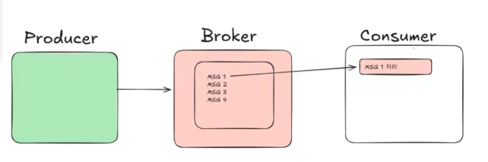

# 0206

  ## Kafka 알아보기


  ## Kafka 이미지 받기
```bash
docker pull apache/kafka:4.0.1
```

  ## Docker Container 만들기
```bash
docker run -d -p 9092:9092 --name kafka apache/kafka:4.0.1
```

  ## Docker Conatiner 접속
```bash
docker exec -it kafka /bin/bash
```

  ## kafka 설치 위치
```bash
- `/opt/kafka/bin/`
```

  ## topic 만들기 / list 보기 / 삭제
```bash
./kafka-topics.sh --bootstrap-server localhost:9092 --create --topic my-topic
./kafka-topics.sh --bootstrap-server localhost:9092 --list
./kafka-topics.sh --bootstrap-server localhost:9092 --delete --topic my-topic
```
 ## topic 보기
 ```bash
./kafka-console-consumer.sh --bootstrap-server localhost:9092 --topic test --from-beginning
```

 ## Apache Kafka 명령어 
- ./kafka-topics.sh : 토픽 생성/조회/수정/삭제 명령어
- ./kafka-console-consumer.sh : 카프카 메시지를 콘솔로 출력하는 소비자(Consumer) CLI 명령어
- ./kafka-console-producer.sh : 메시지를 콘솔에서 직접 입력하여 카프카에 전송하는 Producer CLI 명령어
- ./zookeeper-shell.sh : ZooKeeper 서버에 연결하여 Znode 정보 조회/조작 명령어

| 명령어 | 주요 목적 | 핵심 옵션 |
| :--- | :--- | :--- |
| kafka-topics.sh | 토픽 관리 | --create / --list / --describe / --bootstrap-server |
| kafka-console-consumer.sh | 메시지 읽기 | --topic / --from-beginning / --group |
| kafka-console-producer.sh | 메시지 발행 | --topic / --property parse.key=true |
| zookeeper-shell.sh | Zookeeper 관리 | ls, get, create, delete |

